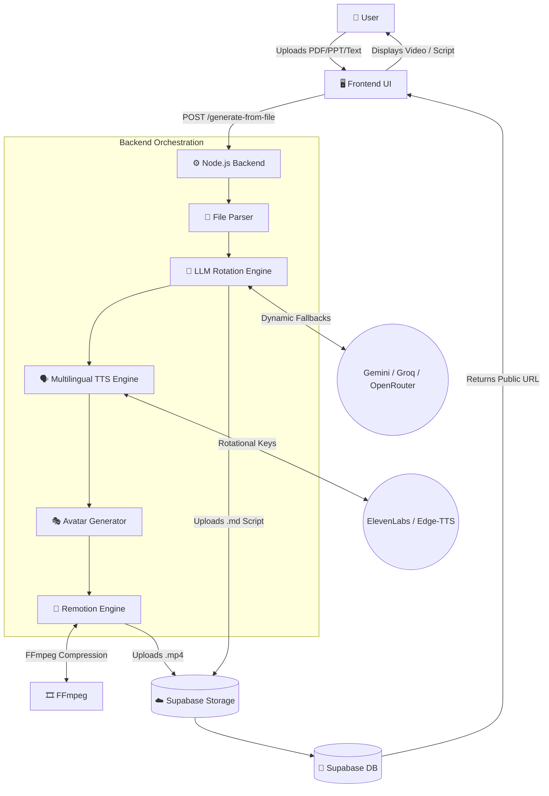
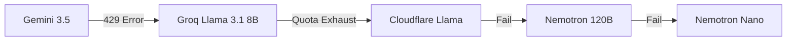

# 🏗️ CodeSeekho V3 — Technical Report & System Architecture

## 1. Executive Summary
**CodeSeekho V3** is an automated, AI-driven educational pipeline that transforms raw unstructured data (text, PDFs, PPTs, Markdown) into highly engaging, lip-synced educational avatar videos and deeply structured Markdown study notes. Built for scale and resilience, the system supports 11+ Indian regional languages with native script generation, automated AI fallback chains, and programmatic video rendering.

---

## 2. System Architecture Overview

The system follows a decoupled Client-Server architecture utilizing a combination of Edge APIs, a Node.js backend, and a React-based programmatic video rendering engine (Remotion).



---

## 3. Technology Stack

### 3.1 Frontend & Rendering Layer
* **Framework:** React.js
* **Video Engine:** [Remotion](https://www.remotion.dev/) (Programmatic React video generation)
* **Styling:** CSS3, Glassmorphism UI
* **Real-time Comms:** Server-Sent Events (SSE) for progress streaming

### 3.2 Backend Layer
* **Runtime:** Node.js + Express.js
* **Media Processing:** FFmpeg (H.264 CRF compression), `ffprobe` (audio duration sync)
* **File Parsing:** `pdf-parse`, `mammoth` (DOCX), PPT extraction utilities

### 3.3 Database & Storage
* **Provider:** Supabase (PostgreSQL)
* **Storage:** Supabase Object Storage (S3-compatible) for MP4s and Markdown scripts.

### 3.4 AI & Machine Learning Integrations
* **LLMs:** Google Gemini 3.5 Flash Lite, Groq Llama 3.1, Cloudflare Llama, OpenRouter (Nemotron, Qwen).
* **Text-to-Speech:** ElevenLabs (Premium), Deepgram (Ultra-fast), Edge-TTS (Regional fallback).
* **Avatar Sync:** SadTalker / Remotion dynamic avatar rendering.

---

## 4. The 5-Phase Video Generation Pipeline

### Phase 1: LLM Orchestration & Structuring
The user’s raw text is extracted and injected into a highly engineered prompt (`buildVideoPrompt`). 
The LLM generates a strictly formatted JSON array of **10-12 scenes**, categorizing content into `intro`, `explainer`, `flowchart`, `comparison`, and `code`. 

> **Translation Engine:** If a regional language is selected, the LLM forces the entire script (titles, bullet points, narrative) into the native Unicode script (e.g., Devanagari for Hindi, Bengali script for Bengali).

### Phase 2: Speech Synthesis (TTS)
The backend loops through the JSON scenes, passing the narrative text to `voiceGenerator.js`. The system ensures perfect lip-sync by generating high-quality MP3s per scene. 

### Phase 3: Avatar Alignment
A static avatar image is mapped against the audio waveforms to generate word-level lip-sync data.

### Phase 4: Programmatic Video Rendering (Remotion)
`server.js` dynamically spawns a Remotion CLI process:
```bash
npx remotion render src/Root.jsx <jobId> out/video/<jobId>.mp4 --props '{"script":...}'
```
React components (`<Scene>`, `<Audio>`, `<Sequence>`) map the JSON script and MP3s onto a 1920x1080 canvas frame-by-frame.

### Phase 5: FFmpeg Compression & Cloud Synchronization
Uncompressed Remotion MP4s (often 60MB+) are passed through an FFmpeg compression matrix:
```bash
ffmpeg -y -i input.mp4 -vf scale=720 -c:v libx264 -crf 28 -preset fast output.mp4
```
This reduces payload size by ~70-80%. The final asset is pushed to Supabase Storage, a database record is inserted, and the public URL is yielded to the client.

---

## 5. Resilience & Fault Tolerance Models

CodeSeekho V3 implements extreme redundancy to ensure zero-downtime content generation.

### 5.1 LLM Token Exhaustion Rotation
If the primary LLM (Gemini) hits an HTTP 429 (Rate Limit) or exhausts its daily quota, the engine catches the exception and cascades down a predefined list of backup models.



### 5.2 TTS Key Pooling
ElevenLabs enforces a strict 10,000 character limit per free key. The environment dynamically aggregates multiple keys:
```env
ELEVENLABS_API_KEY=key1,key2,key3,key4
```
The rotation algorithm traverses the array. If `key1` throws an HTTP 401/402, the generator switches to `key2` mid-pipeline without breaking the video render. If all keys exhaust, it downgrades to Microsoft Edge-TTS seamlessly.

---

## 6. Database Schema (Supabase)

**Table:** `videos`

| Column | Data Type | Description |
|---|---|---|
| `job_id` | `UUID` (Primary) | Unique identifier for the generation job |
| `title` | `TEXT` | Extracted title of the document |
| `language` | `TEXT` | Target language (e.g., Hindi, English) |
| `scene_count`| `INT` | Number of generated scenes or topics |
| `script_json`| `JSONB` | Full AI-generated script object |
| `video_url` | `TEXT` | Public Supabase URL (MP4 or MD) |
| `storage_path`| `TEXT` | Internal bucket path for cleanup |
| `status` | `TEXT` | `completed`, `failed`, or `script_only` |
| `created_at` | `TIMESTAMP`| ISO 8601 generation time |

---

## 7. Future Scalability
* **Message Queues:** Moving from synchronous Express HTTP limits to a Redis/RabbitMQ based worker queue (e.g., BullMQ) for concurrent mass-rendering.
* **Serverless GPU:** Offloading Avatar generation to RunPod or Replicate for heavy deep-learning inference.
